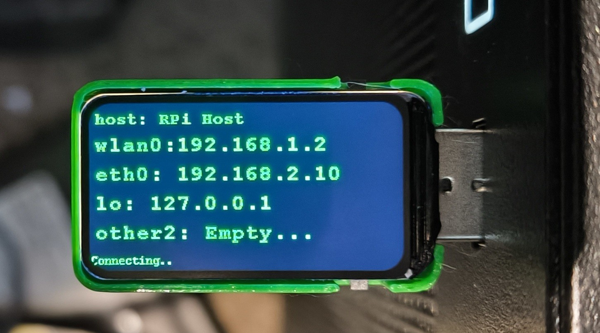

# 🖥️ USB IP & MAC Address Display

> RP2350 + Waveshare 1.47" LCD — Plug in via USB to see your computer's IP and MAC addresses instantly!



A tiny RP2350-based gadget that plugs into any computer via USB and displays the hostname, IP addresses, and MAC addresses on a 1.47" LCD screen. Works on **Linux**, **macOS**, and **Windows**.

## ✨ Features

- 📺 **1.47" LCD Display** — Shows hostname, WiFi IP/MAC, Ethernet IP/MAC
- ⌨️ **USB HID Keyboard** — Types commands automatically on the host
- 🔄 **Auto-refresh** — Updates every 10 seconds
- 🌐 **Multi-OS Support** — Linux, macOS, and Windows versions
- 🎨 **Customizable** — Change colors and language settings

## 📁 Project Structure

```
rpi_usb_ip_display/
├── show_rpi_ip_Linux/      # 🐧 Linux version (Raspberry Pi, Ubuntu, Debian)
├── show_rpi_ip_macos/      # 🍎 macOS version
├── show_rpi_ip_windows/    # 🪟 Windows version
├── 3d printed shell/       # 🖨️ 3D printable enclosure
└── images/                 # 📸 Reference images
```

## 🖼️ Display Layout

```
┌────────────────────────────────┐
│ host: raspberrypi              │  ← Hostname
│ wlan0: 192.168.1.100           │  ← WiFi IP
│   MAC: aa:bb:cc:dd:ee:ff       │  ← WiFi MAC
│ eth0: 192.168.1.101            │  ← Ethernet IP
│   MAC: 11:22:33:44:55:66       │  ← Ethernet MAC
│ Updated 5s                     │  ← Status
└────────────────────────────────┘
```

## 🔧 Hardware Requirements

| Component | Description |
|-----------|-------------|
| **Board** | RP2350 (Raspberry Pi Pico 2) or compatible |
| **Display** | Waveshare 1.47" LCD (172×320, ST7789) |
| **Cable** | USB-C data cable |

### Pin Connections

| LCD Pin | RP2350 GPIO |
|---------|-------------|
| DC | GPIO 16 |
| CS | GPIO 17 |
| CLK | GPIO 18 |
| MOSI | GPIO 19 |
| RST | GPIO 20 |
| BL | GPIO 21 |

## 🚀 Quick Start

### 1. Choose Your OS Version

| Target OS | Folder | Terminal Method |
|-----------|--------|-----------------|
| 🐧 Linux | `show_rpi_ip_Linux/` | `Ctrl+Alt+T` |
| 🍎 macOS | `show_rpi_ip_macos/` | Spotlight → Terminal |
| 🪟 Windows | `show_rpi_ip_windows/` | `Win+R` → PowerShell |

### 2. Flash the Firmware

**Option A: Using Pre-built UF2 (Easiest)**
1. Hold **BOOTSEL** button on RP2350
2. Plug into computer while holding
3. Release — a drive called **RPI-RP2** appears
4. Drag the `.uf2` file from `build/` folder onto the drive
5. Board reboots automatically!

**Option B: Arduino IDE**
1. Install [Arduino IDE](https://www.arduino.cc/en/software)
2. Add RP2040 board support:
   - Preferences → Additional Board URLs:
   ```
   https://github.com/earlephilhower/arduino-pico/releases/download/global/package_rp2040_index.json
   ```
3. Install "Raspberry Pi Pico/RP2040/RP2350" from Boards Manager
4. Open the `.ino` file for your OS
5. Select Board: **Raspberry Pi Pico 2**
6. Set USB Stack: **Adafruit TinyUSB** ⚠️ Required!
7. Upload

**Option C: Arduino CLI**
```bash
# Install board support
arduino-cli core install rp2040:rp2040

# Compile (example for macOS version)
arduino-cli compile \
  --fqbn rp2040:rp2040:rpipico2 \
  --build-property "build.usbstack=-DUSE_TINYUSB" \
  show_rpi_ip_macos/show_rpi_ip_macos.ino

# Flash (with board in bootloader mode)
cp show_rpi_ip_macos/build/*.uf2 /Volumes/RPI-RP2/
```

### 3. Use It!

1. Plug the flashed RP2350 into your target computer
2. **Ensure user is logged in** to a graphical session
3. Watch the display show your IP addresses!

## ⚙️ Configuration

### Colors

Edit the top of any `.ino` file:
```cpp
#define DISPLAY_BG_COLOR BLACK
#define DISPLAY_TEXT_COLOR GREEN
```

Options: `BLACK`, `WHITE`, `GREEN`, `RED`, `BLUE`, `YELLOW`, `CYAN`, `MAGENTA`

### Language (macOS only)

For non-English macOS, edit `show_rpi_ip_macos.ino`:
```cpp
#define TERMINAL_APP_NAME "Terminal"  // English
// #define TERMINAL_APP_NAME "ターミナル"  // Japanese
// #define TERMINAL_APP_NAME "终端"        // Chinese
// #define TERMINAL_APP_NAME "터미널"      // Korean
```

## 🖨️ 3D Printed Case

A printable enclosure is included in `3d printed shell/`:
- **No supports needed**
- Uses **M2×4mm screws**
- Designed for the Waveshare 1.47" LCD + RP2350 combo

## 🔍 How It Works

1. **USB HID Keyboard**: The RP2350 emulates a keyboard
2. **Opens Terminal**: Types the OS-specific keyboard shortcut
3. **Runs Commands**: Types shell/PowerShell commands to get network info
4. **USB CDC Serial**: Receives the output back over USB serial
5. **Displays Results**: Parses and shows IP/MAC on the LCD

### Commands Used

| OS | IP Command | MAC Command |
|----|------------|-------------|
| Linux | `ip -o -4 addr show` | `ip -o link show` |
| macOS | `ipconfig getifaddr` | `ifconfig \| grep ether` |
| Windows | `Get-NetIPAddress` | `Get-NetAdapter` |

## ⚠️ Requirements & Limitations

- **User must be logged in** to a graphical desktop
- **Screen must be unlocked** (device types on the keyboard!)
- **Terminal shortcut must work**:
  - Linux: `Ctrl+Alt+T` opens terminal
  - macOS: Spotlight enabled, Terminal.app installed
  - Windows: `Win+R` opens Run dialog
- **USB VID 2E8A** is expected (standard for RP2350)

## 🐛 Troubleshooting

| Issue | Solution |
|-------|----------|
| Display stays on "Connecting..." | Ensure user is logged in and screen unlocked |
| Terminal doesn't open | Check keyboard shortcut works manually |
| No IP shown | Interface might be down or named differently |
| macOS: wrong app opens | Change `TERMINAL_APP_NAME` to match your language |
| Windows: nothing happens | Ensure PowerShell execution policy allows scripts |

## 📄 License

MIT License — Feel free to use, modify, and share!

## 🙏 Credits

- **Waveshare** — LCD drivers and examples
- **Earle Philhower** — Arduino-Pico board support
- **Raspberry Pi Foundation** — RP2350 chip

